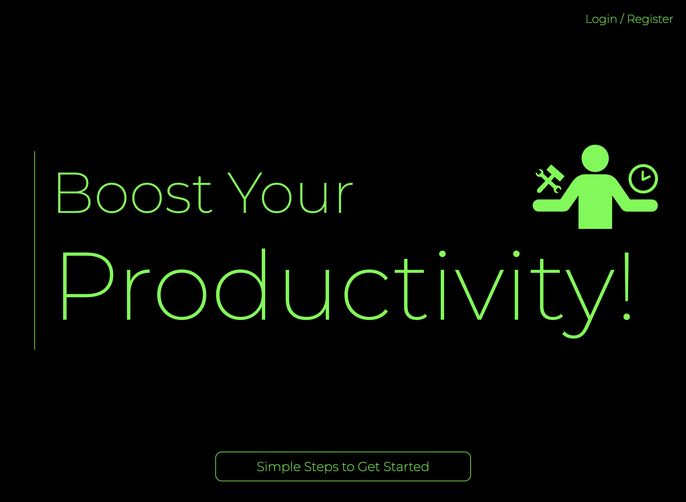

# Productivity Boost

A website application to help you meet your productivity goals.

Users can:

- create an account
- create tasks for today or schedule tasks for the future
- edit or delete tasks as needed
- tick off tasks as you complete them
- track your progress on the Progress Chart over a day, week or month time period

### Tech used

- Vite js
- React JS v18
- React Router v6
- Redux Toolkit
- Firebase (authentication and storage: Firestore)
- Chart JS (for charting user progress)
- CSS Modules 

Optimisations: Code Splitting

### View Live

[View Productivity Boost live](https://productivity-boost.vercel.app/)
